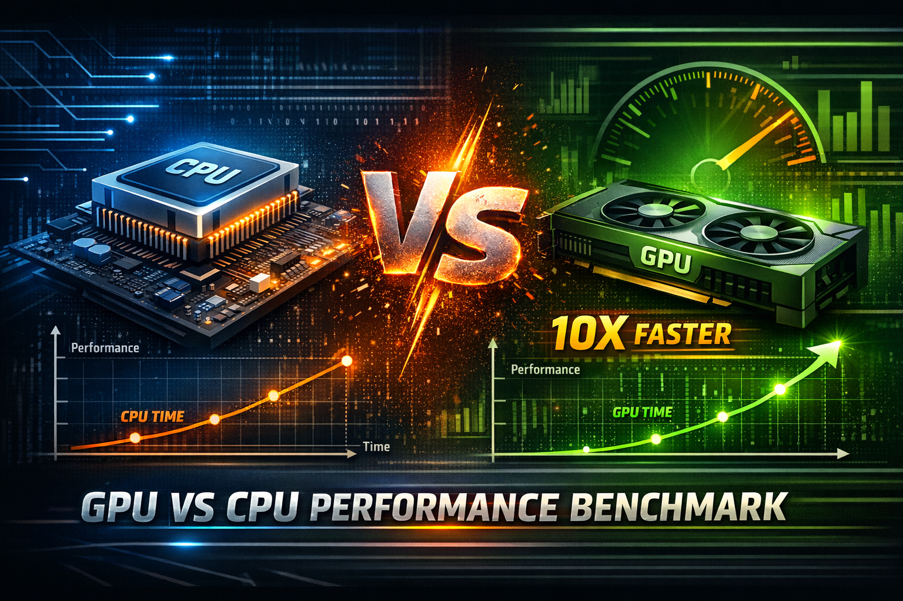
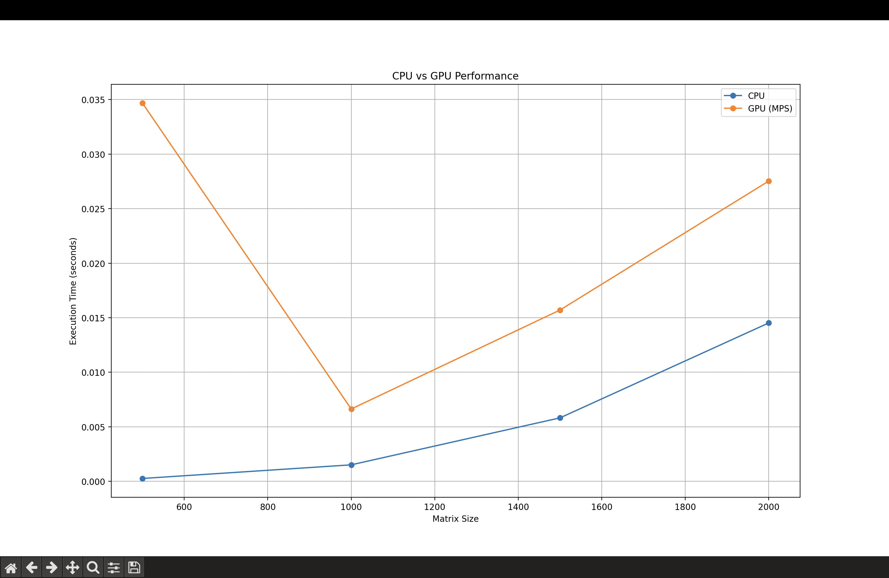
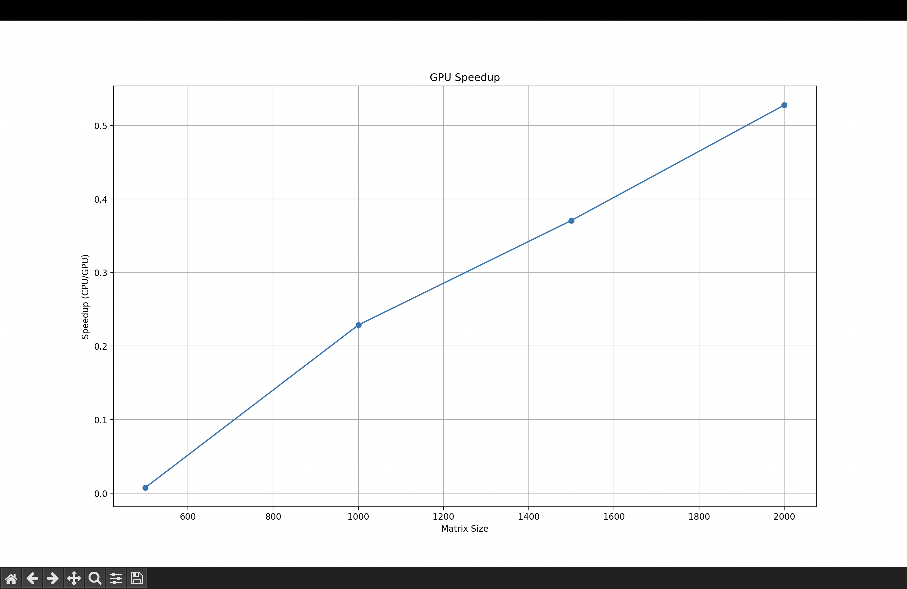
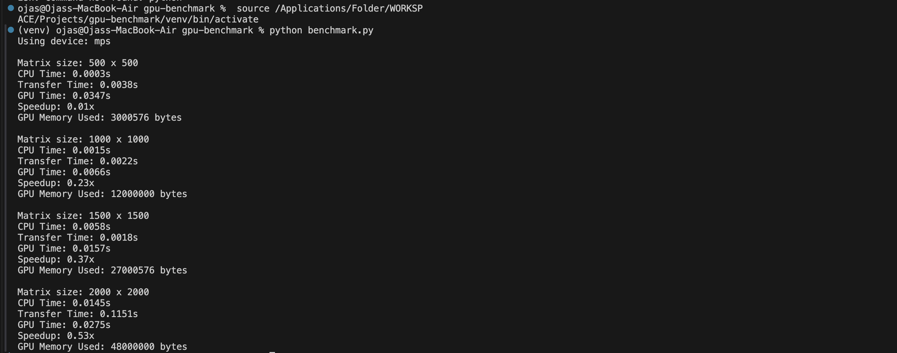

# GPU vs CPU Performance Benchmark



#

High-Performance Computing Benchmark (PyTorch + NumPy + GPU Acceleration)

This project analyzes and compares the execution performance of CPU and GPU for compute-intensive operations. It demonstrates how parallel computing using GPUs significantly improves performance for large-scale workloads.

Designed to simulate real-world performance engineering scenarios — including computation, memory transfer overhead, and scalability analysis.

#

📌 Overview

This project includes:

* Matrix multiplication benchmarking on CPU vs GPU
* Performance measurement (execution time, speedup)
* CPU-GPU data transfer overhead analysis
* GPU memory usage tracking
* Visualization of performance trends
* Support for both Apple MPS and NVIDIA CUDA environments

#

🚀 Features:

🔹 CPU vs GPU Benchmarking

* Executes large matrix operations on CPU and GPU
* Measures execution time and compares performance
* Demonstrates parallel processing advantage

---

🔹 Performance Analysis

* Calculates execution time
* Computes speedup factor (CPU vs GPU)
* Evaluates scalability with increasing input sizes

---

🔹 Memory & Transfer Analysis

* Measures CPU → GPU data transfer overhead
* Tracks GPU memory utilization
* Highlights real-world bottlenecks

---

🔹 Visualization

* CPU vs GPU execution time graph
* Speedup trends
* Performance scaling plots

#

🛠 Setup & Installation:

### 1️⃣ Clone Repository

```bash
git clone https://github.com/OjasSonawane/gpu-vs-cpu-benchmark.git
cd gpu-vs-cpu-benchmark
```

---

### ⚙️ Environment Setup

```bash
python3 -m venv venv
source venv/bin/activate
```

---

### 📦 Install Dependencies

```bash
pip install torch numpy matplotlib
```

---

### ▶️ Run Project

```bash
python benchmark.py
```

#

📊 Sample Output

### 🔹 CPU vs GPU Performance Graph



---

### 🔹 GPU Speedup Graph



#

---

### 🔹 Terminal



#

🧠 Key Learnings

* Parallel computing using GPU acceleration
* Performance trade-offs (latency vs throughput)
* CPU-GPU memory transfer overhead
* Importance of data types (float32 vs float64)
* Real-world system optimization principles

#

🔮 Future Enhancements

* CUDA kernel-level optimization
* Batch processing vs streaming workloads
* Distributed computing experiments
* Web-based performance dashboard

#

⭐ Support

If you find this project useful, consider starring ⭐ the repository!
